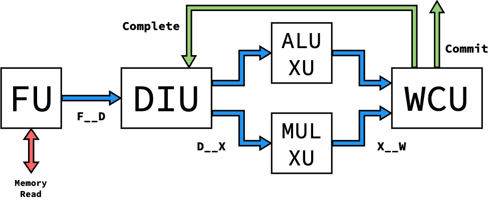

Processor Versions
==========================================================================

Blimp takes an iterative design approach, enabled through its modularity.
Different levels of Blimp's :doc:`microarchitectural units </units/units>`
can be composed to form different versions of Blimp processors. This
enables the design of these components to occur iteratively, adding on
functionality as the complexity of the processor progressed.

Currently, 1 version of the processor is implemented. The table below
details the level of each unit that each processor version requires:

.. list-table::
   :header-rows: 1
   :stub-columns: 1

   * - Proc. Version
     - FU Level
     - DIU Level
     - XU Levels
     - WCU Level
     - SQU Level
     - SU Level
   
   * - V1
     - 1
     - 1
     - 1
     - 1
     -
     -

Version 1
--------------------------------------------------------------------------

The Version 1 processor is the simplest version, and aims to be the
baseline needed for assembly execution with modular units. Only three
instructions are supported (``add``, ``addi``, and ``mul``). The processor
is single-issue with in-order issue and completion, and assumes that
Execute Units are single-cycle to maintain instruction ordering.

.. admonition:: Instruction Routing/Arbitration
   :class: note

   To prepare for out-of-order implementations, the Level 1 DIU
   dynamically routes instructions to XUs based on availability, and the
   Level 1 WCU implements Round-Robin arbitration to select which XU to
   receive an instruction from. However, this isn't relevant based on
   the single-cycle guarantee of XUs, and could be replaced if needed
   for area.