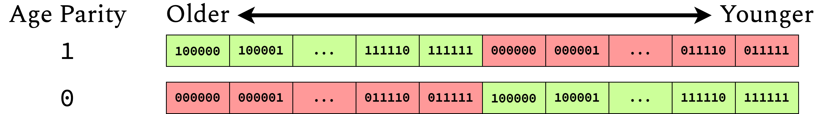
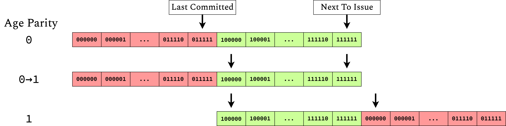

Sequence Numbers
==========================================================================

Blimp uses sequence numbers in order to keep track of the ordering of
different instructions. Sequence numbers are issued in-order in the
decode-issue unit. These allow for the determination of which instruction
is older, such as for ensuring in-order commit and determining the older
branch if multiple are present.

Representation
--------------------------------------------------------------------------

Sequence numbers are represented using two fields; the _intra_-sequence
bits, and the _inter_-speculation bits. 

 - __Intra-sequence bits__ are used for counting instructions within a
   speculation sequence (a.k.a. between branches)
 - __Inter-sequence bits__ are used for distinguishing different
   speculations sequences (a.k.a. instructions that would result from
   different branches)

By default, each instruction will have the same inter-sequence bits as the
previous one, with an incremented intra-sequence field compared to the
previous one. When a squash is encountered, the intra-sequence bits are
reset to zero, and the inter-sequence bits being issued to instruction are
incremented.

We assume that intra-speculation instructions are more frequent, and
accordingly use more bits to represent them (although both sizes are
parametrizable). The default is to use 2 inter-speculation bits, and
6 intra-speculation bits

```{wavedrom}
{reg: [
  { bits: 6, name: "intra", type: 7 },
  { bits: 2, name: "inter", type: 5 }
]}
```

Age Comparison
--------------------------------------------------------------------------

Determining which sequence number is older can be done by a simple
comparison, with the inter-sequence bits taking precedence:

 - If the inter-sequence bits are unequal, the older sequence number is
   the one with lesser inter-sequence bits (issued earlier)
 - Otherwise, if the intra-sequence bits are unequal, the older sequence
   number is the one with lesser intra-sequence bits (issued earlier)
 - Otherwise, the sequence numbers are the same. This should never be the
   case; the decode-issue unit must keep track of in-flight sequence
   numbers, only re-using a number once the previous one has committed.
   Since instructions are committed in-order, keeping track of the last
   committed sequence instruction can be done with a counter

Overflow and Age Parity
--------------------------------------------------------------------------

One of the issues with sequence numbers is the behavior when sequence
numbers run out; when incrementing the next sequence number for each
instruction, the number of dynamic instructions will quickly exceed the
range of sequence numbers for any finite representation. If normal
overflow is assumed, the relative age of sequence numbers will be
improperly determined (ex. even though a 0 was issued after a 63, it will
still be considered older by comparison).

To address this, Blimp uses an _age parity_ for both inter- and
intra-sequence numbers. This is a single bit (two bits for both 
inter-sequence and intra-sequence) set by the decode-issue unit and used
by any sequence number comparator. The logic is as follows:

 - If the age parity is 1, the relative numbers should be compared using a
   __signed__ comparison
 - If the age parity is 0, the relative numbers should be compared using
   an __unsigned__ comparison



The decode-issue unit must monitor which sequence numbers are in-flight,
and set the parity appropriately so that all comparisons are accurate.
This involves waiting until all in-flight sequence numbers will be
compared correctly regardless of parity, switching the age parity, and
then allowing more sequence numbers to be issued. This results in a
possible limitation to only using half of the sequence numbers that could
be represented; however, this only involves the possible unuse of one bit,
so the cost of an extra one bit to recover the desired range is
inexpensive.



This system allows sequence numbers to be continuously allocated and
compared while wasting a maximum of one bit.
