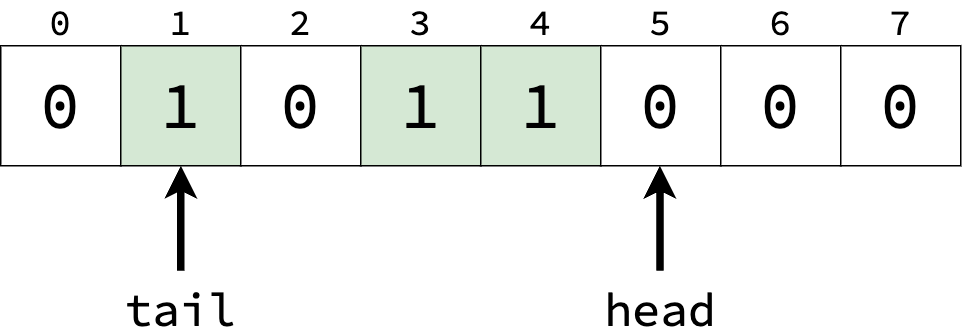
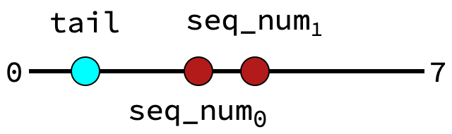

Sequence Numbers
==========================================================================

As part of the modular, out-of-order architecture, Blimp needs a way to
keep track of a global ordering between instructions. This is used to
reorder instructions in the WCU, as well as to compare ages of
instructions in the event of a squash.

This is implemented through the use of *sequence numbers*. Each
instruction is allocated a sequence number in the DIU. This number
follows the instruction throughout the pipeline, and is used in the WCU
to reorder instructions. Once the instruction commits, the sequence
number is freed, and can be used again.

Linear Sequence Numbers
--------------------------------------------------------------------------

To understand sequence numbers, let's first consider them as a range of
values, 0 - 7. The SQU (responsible for allocating and freeing numbers)
can store these as an array; for any given number, a value of ``1`` at
that index indicates that the number is allocated, and a ``0`` indicates
that it's free.

In this example, the sequence numbers ``1``, ``3``, and ``4`` are 
allocated to in-flight instructions. This array acts as a FIFO buffer:

* When we allocate a sequence number, we allocate the entry that ``head``
  points to. The corresponding entry is set to ``1``, and the ``head``
  pointer increments
* When a sequence number is freed, the corresponding entry is set to ``0``
* The ``tail`` pointer indicates the oldest in-flight sequence number.
  When that entry is freed, ``tail`` can increment.

To avoid overlap, we can't allow ``head`` to increment enough to reach
``tail``; in this case, the allocation must wait until ``tail``
increments.

Linear Age Logic
--------------------------------------------------------------------------

Since we know where ``tail`` is, we can also determine the relative age of
each sequence number. Let's first consider the case where both sequence
numbers are on the same "side" of the ``tail`` pointer:

Here, the comparison is simple; the older sequence number is the lesser
one (closest to the tail):

.. code-block:: sv

   assign is_older = ( seq_num_0 < seq_num_1 );

However, let's now consider the case where sequence numbers wrap-around
(a.k.a. one sequence number is less than ``tail``, indicating we've
started allocating below where we're freeing):

Here, the comparison should be reversed; the lesser sequence number is
now younger, since it is less than ``tail``. The comparison should be
flipped for each sequence number that is less than the tail:

.. code-block:: sv

   assign is_older = ( seq_num_0 < seq_num_1 ) ^
                     ( seq_num_0 < tail      ) ^
                     ( seq_num_1 < tail      );

Credit: `SonicBOOM <https://github.com/riscv-boom/riscv-boom/blob/7184be9db9d48bd01689cf9dd429a4ac32b21105/src/main/scala/v3/util/util.scala#L363>`_

Epoch Sequence Numbers
--------------------------------------------------------------------------

While the linear approach above successfully leads to a global ordering,
determining the age logic can be somewhat logic-intensive; it involves
large comparisons, and is used extensively across the processor. To
alleviate this, Blimp generalizes the above approach into *epochs*, where
the range of sequence numbers is divided into epochs:

.. image:: img/seq_nums_epoch.png
   :align: center
   :width: 70%
   :alt: A picture of epoch-organized sequence numbers
   :class: bottompadding

We now also revise the semantics of the ``tail`` pointer; if an allocation
would now cause ``head`` to be in the same epoch as ``tail``, the
allocation must wait until ``tail`` proceeds to the next epoch. This
reduces the maximum number of instructions in-flight by
``epoch_size - 1``; in the above example, this reduces by 1.

Epoch Age Logic
--------------------------------------------------------------------------

The benefits of epochs are in the age comparison logic; instead of needing
to compare the entire sequence number, we now have the guarantee that
epochs provide a global ordering, and can only compare the epochs of
sequence numbers (which can be obtained by a simple bit-slice). We must
also consider the case where the epochs are the same, in which case we
compare the (remaining) sequence number bits like before:

.. code-block:: sv

  always_comb begin
    if( seq_num_0_epoch == seq_num_1_epoch )
      is_older = ( seq_num_0_non_epoch < seq_num_1_non_epoch );
    else
      is_older = ( seq_num_0_epoch < seq_num_1_epoch ) ^
                 ( seq_num_0_epoch < tail_epoch      ) ^
                 ( seq_num_1_epoch < tail_epoch      );
  end

Note that the primary comparisons (in the ``else`` case) now only
need to be done on the epoch bits, not the entire sequence number (at the
cost of an equality comparison and another small inequality). Depending on
the bit-widths used, this can reduce the logic involved in comparing
sequence number ages, decreasing area utilization at the cost of maximum
instructions in-flight. Blimp allows the sequence number and epoch bits
to be parametrizable for design-space exploration, depending on the
use case.